# Bring Your Own AI Gateway to Foundry (Preview)

<div style="background-color: #e6f3ff; padding: 20px; border-left: 5px solid #0078d4; margin: 20px 0;">
<strong>🚀 Enterprise AI Integration</strong><br>
Connect your existing AI model gateways with Foundry to maintain control while leveraging powerful agent capabilities.
</div>

## 📋 Table of Contents

- [Introduction](#-introduction)
- [Architecture Overview](#-architecture-overview)
- [Connection Categories](#-connection-categories)
- [Current Limitations](#-current-limitations)
- [Prerequisites](#-prerequisites)
- [Getting Started](#-getting-started)
- [Resources & Links](#-resources--links)

---

## 🌟 Introduction

The **Bring Your Own AI Gateway** feature in Foundry enables organizations to connect and use AI models hosted behind their enterprise gateways directly within the Foundry platform. This capability allows you to maintain control over your model endpoints while leveraging the power of Foundry's agent capabilities.

### 💡 Key Benefits

<table style="width: 100%; border-collapse: collapse; margin: 20px 0;">
<tr style="background-color: #f8f9fa;">
<td style="padding: 15px; border: 1px solid #dee2e6; font-weight: bold;">🔒 Maintain Control</td>
<td style="padding: 15px; border: 1px solid #dee2e6;">Keep your model endpoints secure behind your existing enterprise infrastructure</td>
</tr>
<tr>
<td style="padding: 15px; border: 1px solid #dee2e6; font-weight: bold;">🏢 Enterprise Integration</td>
<td style="padding: 15px; border: 1px solid #dee2e6;">Leverage your existing gateway investments and security policies</td>
</tr>
<tr style="background-color: #f8f9fa;">
<td style="padding: 15px; border: 1px solid #dee2e6; font-weight: bold;">🔐 Secure Access</td>
<td style="padding: 15px; border: 1px solid #dee2e6;">Build intelligent agents that use models without exposing them publicly</td>
</tr>
<tr>
<td style="padding: 15px; border: 1px solid #dee2e6; font-weight: bold;">📊 Governance</td>
<td style="padding: 15px; border: 1px solid #dee2e6;">Apply your organization's compliance and governance requirements to AI model access</td>
</tr>
</table>

> [!IMPORTANT]
> **Preview Status**: This feature is currently in preview and may have breaking changes.

---

## 🏗️ Architecture Overview

Foundry's gateway integration supports a flexible architecture that accommodates various enterprise gateway scenarios. The **Agents Service interacts with your model gateway using the configured connection** to access AI models securely through your enterprise infrastructure.

### 🔄 Communication Flow

#### 1️⃣ Configuration Flow (One-time Setup)

```mermaid
graph TD
    A[👤 Customer] -->|Creates| B[🔧 Foundry Connection<br/>APIM/ModelGateway]
    B -.->|Contains| C[📋 Configuration Details]
    
    C --> D[🌐 Gateway Endpoint Details]
    D --> D1[Base URL/Endpoint]
    D --> D2[API Version]
    D --> D3[Endpoint Path/Route]
    
    C --> E[🔑 Authentication Configuration]
    E --> E1[🔐 API Key]
    E --> E2[🛡️ OAuth 2.0]
    E --> E3[🆔 Azure AD/Entra ID]
    
    C --> F[🔍 Model Discovery Config]
    F --> F1[� Static Models List]
    F --> F2[🌐 Discovery Endpoint]
    
    C --> G[⚙️ Additional Configurations]
    G --> G1[🏷️ Custom Headers]
    G --> G2[📑 Request Metadata]
    G --> G3[⏱️ Timeout Settings]
    
    style A fill:#e1f5fe,color:#000
    style B fill:#fff3e0,color:#000
    style C fill:#f3e5f5,color:#000
    style D fill:#e8f5e8,color:#000
    style E fill:#fff9c4,color:#000
    style F fill:#e3f2fd,color:#000
    style G fill:#fce4ec,color:#000
```



<div style="background-color: #f8f9fa; padding: 20px; border-radius: 8px; margin: 20px 0;">

**🔧 Configuration Components Breakdown:**

| Component | Description | Examples |
|-----------|-------------|----------|
| **🌐 Gateway Endpoints** | Base URLs and API routing details | `https://my-gateway.company.com/api/v1` |
| **🔑 Authentication** | Security credentials and methods | API keys, OAuth tokens, Azure AD integration |
| **🔍 Model Discovery** | How to find available models | Static list or dynamic discovery endpoint |
| **⚙️ Additional Config** | Custom headers, metadata, timeouts | `X-Custom-Header: value`, request timeouts |

</div>

#### 2️⃣ Runtime Communication Flow (During Agent Execution)

```mermaid
graph TB
    subgraph ModelDiscovery["📋 Model Discovery Flow"]
        direction LR
        A1[🤖 Foundry<br/>Agents Service] -->|1. Read Config| B1[🔧 Connection<br/>Configuration]
        A1 -->|2. Check Model Source| C1{Static Models<br/>Configured?}
        C1 -->|Yes| D1[✅ Use Static<br/>Model List]
        C1 -->|No - Discovery URL| E1[🏢 Customer's<br/>Gateway]
        E1 -->|3. GET /models| F1[🧠 AI Models]
    end
    
    subgraph InferenceFlow["💬 Inference Flow (Chat Completion)"]
        direction LR
        A2[🤖 Foundry<br/>Agents Service] -->|1. Read Config| B2[🔧 Connection<br/>Configuration]
        A2 -->|2. POST /chat/completions| C2[🏢 Customer's<br/>Gateway]
        C2 -->|3. Forward Request| D2[🧠 AI Models]
    end
    
    ModelDiscovery ~~~ InferenceFlow
    
    style A1 fill:#0078d4,color:#fff
    style B1 fill:#fff3e0,color:#000
    style C1 fill:#ffd54f,color:#000
    style D1 fill:#c8e6c9,color:#000
    style E1 fill:#40e0d0,color:#000
    style F1 fill:#90ee90,color:#000
    style A2 fill:#0078d4,color:#fff
    style B2 fill:#fff3e0,color:#000
    style C2 fill:#40e0d0,color:#000
    style D2 fill:#90ee90,color:#000
```



<div style="background-color: #f8f9fa; padding: 20px; border-radius: 8px; margin: 20px 0;">

**🔄 Two Communication Flows with Connection Configuration:**

| Flow Type | Steps | Purpose | Forward Calls |
|-----------|-------|---------|---------------|
| **📋 Model Discovery** | 1. Read config → 2. Check source → 3. Use static OR call discovery | Get available models | `GET /models` (if discovery endpoint configured) |
| **💬 Inference Flow** | 1. Read config → 2. Make chat request | AI model requests | `POST /chat/completions` with tools |

**📝 Flow Details:**

**Model Discovery (Forward Flow):**
- Step 1: Foundry Agents Service reads connection configuration
- Step 2: Foundry Agents Service checks if static models are configured or discovery endpoint is set
- **If Static Models**: Use pre-configured model list directly
- **If Discovery Endpoint**: Forward `GET /models` call through customer gateway to AI models

**Inference Flow (Forward Flow):**
- Step 1: Foundry Agents Service reads connection configuration
- Step 2: Foundry makes `POST /chat/completions` call to customer gateway
- Step 3: Gateway forwards request to AI models

</div>
- **Static Configuration**: Model list is pre-configured in the connection
- **Dynamic Discovery**: Agents Service calls customer gateway's discovery endpoint

</div>

> [!IMPORTANT]
> **Key Architecture Points**: 
> - The Foundry connection is **configuration only** - it's not in the data path
> - All AI model requests flow **directly** from Agents Service to your gateway
> - The connection acts as a **secure credential store** and endpoint registry

### 🚪 Supported Gateway Types

<div style="display: flex; gap: 20px; margin: 20px 0;">

<div style="flex: 1; background-color: #f0f8ff; padding: 20px; border-radius: 8px; border-left: 4px solid #0078d4;">
<h4>🏢 Azure API Management</h4>
<p>Enterprise-grade API gateway with built-in Azure integration and advanced security features</p>
</div>

<div style="flex: 1; background-color: #f0fff0; padding: 20px; border-radius: 8px; border-left: 4px solid #28a745;">
<h4>🔧 Self-Hosted Gateways</h4>
<p>Custom gateway solutions deployed in your own infrastructure with full control</p>
</div>

<div style="flex: 1; background-color: #fff5f5; padding: 20px; border-radius: 8px; border-left: 4px solid #dc3545;">
<h4>🌐 Third-Party Gateways</h4>
<p>Enterprise solutions like MuleSoft, Kong, or other API management platforms</p>
</div>

</div>

### ✅ Gateway Prerequisites

To work with Foundry Agents Service, your gateway must meet these requirements:

<div style="background-color: #fff3cd; padding: 20px; border-radius: 8px; margin: 20px 0;">

#### 1️⃣ **LLM Inferencing**
- Expose a chat completion endpoint that supports standard AI model requests

#### 2️⃣ **Model Discovery**
Choose one of the following options:
- **📋 Static Configuration**: Configure the deployment list in the connection metadata, or
- **🔍 Dynamic Discovery**: Expose a get deployment endpoint on the gateway

#### 3️⃣ **Authentication**
- Use one of the available authentication methods supported by Foundry connections

#### 4️⃣ **Networking**
- **🌐 Public Networking**: If gateway endpoints are accessible on public internet, no separate setup required
- **🔐 Fully Secured Network Setup**: Use Agents BYO VNet feature
  - **For APIM**: Use [this Bicep template](../15-private-network-standard-agent-setup/) for secure setup
  - **For other model gateways**: Ensure your gateway is reachable within the BYO VNet

</div>

---

## 🔌 Connection Categories

Foundry supports **two primary connection types** for gateway integration:

### 🏢 APIM (API Management) Connections

<div style="background-color: #e6f3ff; padding: 25px; border-radius: 8px; margin: 20px 0;">

**Specialized connections designed for Azure API Management integration scenarios.**

#### 🎯 Key Characteristics:
- Uses `"category": "ApiManagement"` for proper APIM-specific handling
- Provides intelligent defaults for standard APIM endpoints
- Follows Azure API Management naming and routing conventions
- Enterprise-ready fully secured network setup for production APIM gateway scenarios

#### 🔐 Authentication Support:
- **🔑 API Key**: Subscription key authentication
- **🆔 Microsoft Entra ID**: Azure Active Directory integration *(coming soon)*

</div>

### 🌉 ModelGateway Connections

<div style="background-color: #f0fff0; padding: 25px; border-radius: 8px; margin: 20px 0;">

**Unified connections for various AI model providers through self-hosted or third-party gateways.**

#### 🎯 Key Characteristics:
- Uses `"category": "ModelGateway"` for proper routing
- Single interface for multiple AI providers (Azure OpenAI, OpenAI, etc.)
- Supports both static model configuration and dynamic model discovery
- Supports API Key and OAuth Client Credentials Authentication

</div>

---

## ⚠️ Current Limitations

<div style="background-color: #fff3cd; padding: 20px; border-radius: 8px; border-left: 4px solid #ffc107; margin: 20px 0;">

### 🚧 Preview Limitations

| Aspect | Current Status |
|--------|----------------|
| **🔄 Preview Status** | Feature is in preview with potential breaking changes |
| **🖥️ UI Support** | UI support not currently available - requires Azure CLI for connection management |
| **🤖 Agent Support** | Supports Prompt Agents |
| **🏢 APIM Tier Support** | Only Azure API Management Standard v2 and Premium tiers supported |

</div>

---

## 📋 Prerequisites

### 🔧 Azure Requirements

<div style="display: grid; grid-template-columns: 1fr 1fr; gap: 20px; margin: 20px 0;">

<div style="background-color: #f8f9fa; padding: 20px; border-radius: 8px;">
<h4>☁️ Azure Subscription</h4>
<p>Active subscription with access to Foundry</p>
</div>

<div style="background-color: #f8f9fa; padding: 20px; border-radius: 8px;">
<h4>📊 Foundry Project</h4>
<p>Configured project in your Foundry workspace</p>
</div>

</div>

### 🛠️ Tools and SDKs

<table style="width: 100%; border-collapse: collapse; margin: 20px 0;">
<thead style="background-color: #0078d4; color: white;">
<tr>
<th style="padding: 15px; text-align: left;">Tool</th>
<th style="padding: 15px; text-align: left;">Description</th>
<th style="padding: 15px; text-align: left;">Link</th>
</tr>
</thead>
<tbody>
<tr style="background-color: #f8f9fa;">
<td style="padding: 15px; border: 1px solid #dee2e6;"><strong>Azure CLI</strong></td>
<td style="padding: 15px; border: 1px solid #dee2e6;">Latest version installed and configured</td>
<td style="padding: 15px; border: 1px solid #dee2e6;"><a href="/cli/azure/install-azure-cli">Installation Guide</a></td>
</tr>
<tr>
<td style="padding: 15px; border: 1px solid #dee2e6;"><strong>Foundry SDK</strong></td>
<td style="padding: 15px; border: 1px solid #dee2e6;">Agents V2 SDK for development</td>
<td style="padding: 15px; border: 1px solid #dee2e6;"><em>Link for agent v2</em></td>
</tr>
<tr style="background-color: #f8f9fa;">
<td style="padding: 15px; border: 1px solid #dee2e6;"><strong>Connection Setup</strong></td>
<td style="padding: 15px; border: 1px solid #dee2e6;">Bicep templates for connections</td>
<td style="padding: 15px; border: 1px solid #dee2e6;"><em>Link for connections bicep</em></td>
</tr>
<tr>
<td style="padding: 15px; border: 1px solid #dee2e6;"><strong>APIM Secured Setup</strong></td>
<td style="padding: 15px; border: 1px solid #dee2e6;">Network secured APIM configuration</td>
<td style="padding: 15px; border: 1px solid #dee2e6;"><em>Link for bicep</em></td>
</tr>
</tbody>
</table>

### 🚪 Gateway Prerequisites

> [!NOTE]
> **Detailed Setup Guide**: Consider creating separate documentation for APIM setup with screenshots and verification steps.

#### 🏢 For Azure API Management

<div style="background-color: #e6f3ff; padding: 20px; border-radius: 8px; margin: 15px 0;">

- **🏗️ APIM Instance**: Azure API Management Standard v2 or Premium tier
- **🔑 Subscription Key**: Valid subscription key for API access  
- **📦 Model Deployments**: AI models deployed and accessible through APIM
- **🌐 Network Access**: APIM instance accessible from Foundry

> **💡 Future Enhancement**: Add multiple screenshots showing APIM setup, URL configuration, key management, deployment endpoint setup, and testing procedures.

</div>

#### 🔧 For Self-Hosted/Third-Party Gateways

<div style="background-color: #f0fff0; padding: 20px; border-radius: 8px; margin: 15px 0;">

- **🌐 Gateway Endpoint**: Publicly accessible or network-accessible gateway URL
- **🔐 API Credentials**: Valid API keys or OAuth credentials
- **💬 Model Endpoints**: Chat completion endpoints exposed through your gateway
- **🔍 Discovery Endpoints**: *(Optional)* Model discovery endpoints for dynamic configuration

</div>

### 📚 Sample Code Access

- **📁 GitHub Access**: Access to [Foundry samples repository](https://github.com/azure-ai-foundry/foundry-samples/tree/main/samples/microsoft/infrastructure-setup/01-connections)

---

## 🚀 Getting Started

### Step 1️⃣: Prepare Your Environment

<div style="background-color: #f8f9fa; padding: 20px; border-radius: 8px; margin: 20px 0;">

1. **📥 Clone the samples repository**:
   ```bash
   git clone https://github.com/azure-ai-foundry/foundry-samples.git
   cd foundry-samples/samples/microsoft/infrastructure-setup/01-connections
   ```

2. **🎯 Identify your connection type**:
   - Use APIM templates for Azure API Management gateways
   - Use ModelGateway templates for other gateway types

</div>

### Step 2️⃣: Create Your Gateway Connection

<div style="background-color: #f0fff0; padding: 20px; border-radius: 8px; margin: 20px 0;">

1. **📋 Choose the appropriate template**:
   ```bash
   # For Azure API Management
   ls apim/connection-apim-*.bicep
   
   # For other gateways
   ls model-gateway/connection-modelgateway-*.bicep
   ```

2. **⚙️ Configure connection parameters**:
   ```bash
   # Copy and edit the parameters file
   cp model-gateway/parameters-basic.json my-gateway-params.json
   ```

3. **🚀 Deploy the connection**:
   ```bash
   az deployment group create \
     --resource-group <your-resource-group> \
     --template-file model-gateway/connection-modelgateway-basic.bicep \
     --parameters @my-gateway-params.json
   ```

</div>

### Step 3️⃣: Deploy and Test an Agent

> [!NOTE]
> **Update Required**: This section needs to be updated to use Agents V2 SDK.

<div style="background-color: #fff3cd; padding: 20px; border-radius: 8px; margin: 20px 0;">

1. **🔧 Configure model deployment name**:
   ```bash
   export AZURE_AI_MODEL_DEPLOYMENT_NAME="<connection-name>/<model-name>"
   # Example: AZURE_AI_MODEL_DEPLOYMENT_NAME="my-gateway-connection/gpt-4o"
   ```

2. **🤖 Create and run an agent**:
   ```python
   from azure.ai.foundry import AIFoundryClient
   
   client = AIFoundryClient.from_config()
   # Your agent implementation using the gateway connection
   ```

3. **✅ Validate the setup**:
   - Check connection status in Foundry portal
   - Test agent responses  
   - Verify requests are routed through your gateway

</div>

---

## 📚 Resources & Links

### 📖 Documentation

<div style="display: grid; grid-template-columns: repeat(auto-fit, minmax(300px, 1fr)); gap: 20px; margin: 20px 0;">

<div style="background-color: #f8f9fa; padding: 20px; border-radius: 8px; border-left: 4px solid #0078d4;">
<h4>🔗 Connection Types Overview</h4>
<p><a href="../Connection-Types-Overview.md">Detailed connection configuration guide</a></p>
</div>

<div style="background-color: #f8f9fa; padding: 20px; border-radius: 8px; border-left: 4px solid #28a745;">
<h4>☁️ Foundry Docs</h4>
<p><a href="/azure/ai-foundry/">Complete platform documentation</a></p>
</div>

<div style="background-color: #f8f9fa; padding: 20px; border-radius: 8px; border-left: 4px solid #ffc107;">
<h4>🏢 Azure API Management</h4>
<p><a href="/azure/api-management/">API Management documentation</a></p>
</div>

</div>

### 💻 Sample Code and Templates

- **📁 [Foundry Samples Repository](https://github.com/azure-ai-foundry/foundry-samples)**
- **🛠️ [Connection Bicep Templates](https://github.com/azure-ai-foundry/foundry-samples/tree/main/samples/microsoft/infrastructure-setup/01-connections)**
- **🤖 [Agent Development Samples](https://github.com/azure-ai-foundry/foundry-samples/tree/main/samples/microsoft/python/getting-started-agents)**

### 🛠️ Tools and SDKs

- **⚡ [Azure CLI Installation Guide](/cli/azure/install-azure-cli)**
- **🐍 [Foundry Python SDK](https://pypi.org/project/azure-ai-foundry/)**
- **🔗 [Foundry REST API Reference](/rest/api/azure-ai-foundry/)**

### 🤝 Support and Community

<table style="width: 100%; border-collapse: collapse; margin: 20px 0;">
<tr style="background-color: #f8f9fa;">
<td style="padding: 15px; border: 1px solid #dee2e6; font-weight: bold;">🆘 Foundry Support</td>
<td style="padding: 15px; border: 1px solid #dee2e6;"><a href="/azure/ai-foundry/support">Official support channels</a></td>
</tr>
<tr>
<td style="padding: 15px; border: 1px solid #dee2e6; font-weight: bold;">💬 Azure Community Forums</td>
<td style="padding: 15px; border: 1px solid #dee2e6;"><a href="https://docs.microsoft.com/answers/topics/azure-ai-foundry.html">Community discussions</a></td>
</tr>
<tr style="background-color: #f8f9fa;">
<td style="padding: 15px; border: 1px solid #dee2e6; font-weight: bold;">🐛 GitHub Issues</td>
<td style="padding: 15px; border: 1px solid #dee2e6;"><a href="https://github.com/azure-ai-foundry/foundry-samples/issues">Bug reports and feature requests</a></td>
</tr>
</table>

### 🔗 Related Services

- **🧠 [Azure OpenAI Service](/azure/cognitive-services/openai/)**
- **🤖 [Azure AI Services](/azure/ai-services/)**
- **📊 [Azure Machine Learning](/azure/machine-learning/)**

### 📋 Best Practices and Guidelines

- **🔐 [Security Best Practices](/azure/ai-foundry/security/gateway-security)**
- **⚡ [Performance Optimization Guide](/azure/ai-foundry/performance/gateway-optimization)**
- **🏢 [Enterprise Deployment Patterns](/azure/ai-foundry/enterprise/deployment-patterns)**

---

<div style="background-color: #e6f3ff; padding: 20px; border-radius: 8px; text-align: center; margin: 30px 0;">
<h3>🎯 Ready to Get Started?</h3>
<p>Choose your gateway type and follow the step-by-step guide to integrate your enterprise AI infrastructure with Foundry.</p>
</div>

---

<footer style="margin-top: 50px; padding-top: 20px; border-top: 1px solid #dee2e6; color: #6c757d; text-align: center;">
<p><strong>Document Information</strong></p>
<p>Created: November 2025 | Version: 1.0 | Status: Preview Documentation</p>
<p>Last Updated: November 7, 2025</p>
</footer>